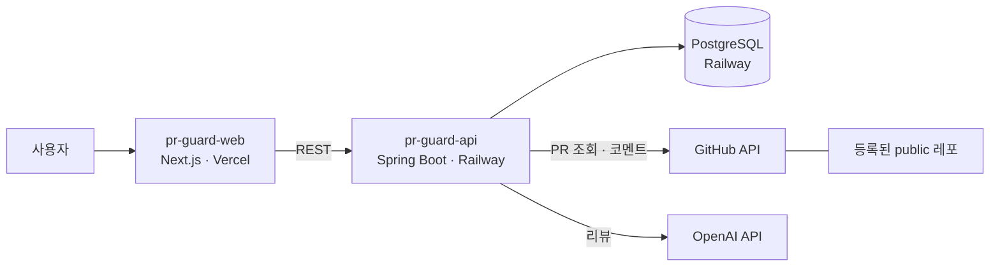

# 🛡️ PR Guard

**사람과 AI가 함께 개발하는 팀에서, 바이브코딩으로 만든 저품질 코드가 머지되는 것을 막고 코드의 신뢰성을 확보하는 PR 검증 플랫폼**

동국대학교 창의융합경진대회 2026

---

## 왜 만드나

AI 코딩 도구 덕분에 팀원 누구나 빠르게 많은 코드를 만들지만, 그 코드는 팀이 쌓아 온 규칙과 남이 짠 코드를 모른 채 작성됩니다.
리뷰어는 모든 맥락을 알 수 없어서 그럴듯한 diff를 통과시키고, 문제는 머지 후에 드러납니다. 여러 PR이 동시에 열려 있으면 각각은 멀쩡해도 함께 머지될 때 깨지기도 합니다.

코드 생성 과정에는 끼어들 수 없으니, **Pull Request가 올라오는 시점**에서 막습니다.
diff만 LLM에 넣는 일반 AI 리뷰와 달리, PR Guard는 **diff + 레포 전체 + git 이력 + PR 설명 + 다른 열린 PR**을 함께 분석해 팀의 관례와 변경 이력을 기준으로, 누가 쓴 코드든 근거를 붙여 검증합니다.

## 동작 방식

```
public 레포 URL 등록
        ↓
PR 자동 감지
        ↓
레포 인덱스 (심볼 · 호출 그래프 · 컴파일 체크 · git 통계)
        ↓
 A. 의도 대비   B. 변경 영향   C. 보안 일관성   D. 변경 위험도   E. PR 간 충돌
        ↓
판정 → PR 리뷰 코멘트 + 분석 과정 시각화
```

| 검사 | 하는 일 |
|---|---|
| **A. 의도 대비 검증** | PR 설명·커밋의 의도와 실제 변경을 대조해 요청하지 않은 변경, 빠진 구현을 찾음 |
| **B. 변경 영향 분석** | 바뀐 코드를 호출하는 곳을 거슬러 올라가 남이 짠 코드가 깨지는 지점과 데이터 정합성 문제를 찾음 |
| **C. 보안 일관성** | 새 API를 비슷한 기존 API와 비교해 팀 코드가 지키는 권한 검사를 빠뜨렸는지 찾음 |
| **D. 변경 위험도** | git 이력상 팀이 늘 함께 바꿔 온 파일이 이번에 빠졌는지 확인 |
| **E. PR 간 충돌 감지** | 동시에 열린 PR들을 서로 대조해, 각각은 멀쩡해도 함께 머지되면 깨지는 조합을 찾음 |

- 근거는 정적 분석·그래프·통계로 만들고, LLM은 해석만 맡습니다.
- 이번 PR이 새로 만든 문제만 보고하고, 판정은 규칙으로 계산합니다.

> 현재 레포 인덱스 · git 이력 · 근거 기반 판정 · 리뷰 과정 실시간 시각화까지 동작하며, A~E 검사 규칙을 붙이는 중입니다.

## 인프라 구조



| 구성 | 위치 | 역할 |
|---|---|---|
| 프론트엔드 | Vercel | 레포 등록, PR·리뷰 결과 화면. 백엔드는 서버에서만 호출 |
| 백엔드 | Railway | 5분마다 열린 PR 폴링, 새 커밋이 보이면 리뷰 작업 생성·처리 |
| DB | Railway PostgreSQL | 프로젝트·PR·리뷰 기록. 외부 공개 없이 백엔드만 내부망으로 접속 |
| 외부 API | GitHub, OpenAI | PR·diff 조회와 코멘트 작성 / LLM 리뷰 |

## 레포지토리

| 레포 | 설명 |
|---|---|
| [pr-guard-api](https://github.com/dongguk-creative-fusion-2026/pr-guard-api) | 백엔드 — PR 폴링, 분석 파이프라인, 리뷰 코멘트 (Spring Boot) |
| [pr-guard-web](https://github.com/dongguk-creative-fusion-2026/pr-guard-web) | 프론트엔드 — 레포 등록, 리뷰 결과 화면 (Next.js) |
| [pr-guard-sandbox](https://github.com/dongguk-creative-fusion-2026/pr-guard-sandbox) | 테스트·시연용 레포 |

## 바로 보기

- 서비스: https://pr-guard-web.vercel.app
- 리뷰 예시: [pr-guard-sandbox PR #1](https://github.com/dongguk-creative-fusion-2026/pr-guard-sandbox/pull/1)
