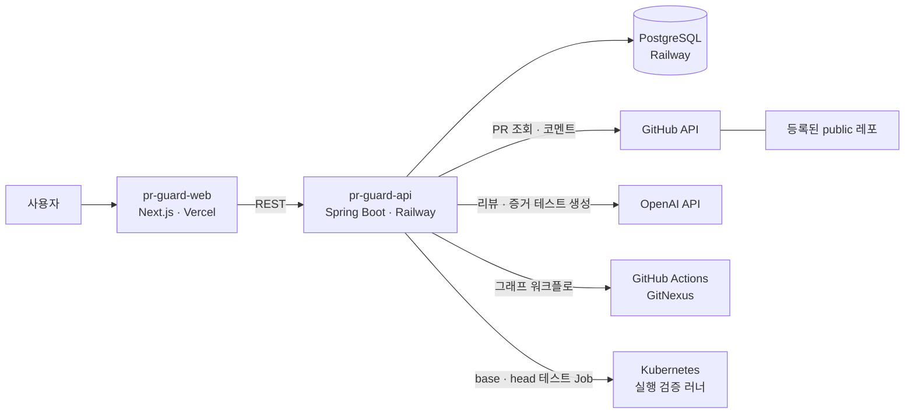

# 🛡️ PR Guard

**AI 네이티브 개발 환경에서, 속도는 그대로 두고 코드 품질을 지키는 PR 검증 계층**

동국대학교 창의융합경진대회 2026

> AI 가 코드를 쓰는 속도로 리뷰하고, 사람은 **증명된 위험**만 본다.

---

## 왜 만드나

AI 코딩 에이전트를 쓰면 PR 은 많아지고 커지는데, 사람이 리뷰할 수 있는 시간은 그대로입니다. 리뷰가 병목이 되고, 결국 "대충 보고 머지" 가 늘어납니다.

AI 가 쓴 코드는 그럴듯해 보이지만 이런 문제가 자주 섞여 들어옵니다.

- 요청하지 않은 변경, 빠진 구현
- 기존 동작을 **조용히** 바꾸는 수정 (예: 예외를 던지던 곳이 `null` 을 반환)
- 레포 맥락을 모른 채 고쳐서 깨지는 호출부, 늘 함께 바뀌던 파일의 누락
- 기존 테스트가 **한 번도 지나가지 않는** 곳의 변경

"AI 로 리뷰한다" 는 이제 흔합니다. PR Guard 는 **AI 의 말을 그대로 믿지 않고, 정적 분석 · 이력 통계 · 실제 실행으로 근거를 만든 뒤** 판정합니다. LLM 은 그 근거를 해석하는 역할만 맡습니다.

## AI 환경의 문제 → PR Guard 가 하는 일

| AI 환경에서 생기는 문제 | PR Guard | 근거를 만드는 방법 |
|---|---|---|
| 변경이 어디까지 번지는지 사람이 다 못 봄 | **영향 범위 시각화** | 함수 단위 호출 그래프에서 바뀐 함수 → 직접 · 간접 호출부 |
| AI 가 기존 동작을 몰래 바꿈 | **실행으로 증명** | 증거 테스트: base 에서 통과하고 head 에서 실패하는 테스트를 만들어 실제로 돌림 |
| 기존 테스트가 깨지는지 모름 | **실행 검증** | 쿠버네티스 Pod 에서 base · head 테스트를 돌려 회귀 비교 |
| 테스트가 실제로 그 코드를 지키는지 모름 | **런타임 트레이스** | 테스트 중 실제 호출을 기록해 바뀐 메서드를 지나간 테스트를 찾음 |
| 레포 맥락 · 관행을 모르는 코드 | **이력 기반 경고** | git 동시 변경 통계, 핫스팟, 숨은 결합 |
| 리뷰어 시간 부족 | **판정 + 근거 요약** | 규칙으로 계산한 판정, PR 코멘트, 단계별 파이프라인 화면 |

## 동작 방식

```
public 레포 URL 등록 → 온보딩 (GitNexus 코드 그래프 · 레포 브리핑)
        ↓
PR 자동 감지
        ↓
base / head 소스 인덱스 → 바뀐 메서드 · 호출부 · git 이력
        ↓
 ┌ 정적 검사  A. 의도 대비   B. 변경 영향   C. 보안 일관성   D. 변경 위험도
 ├ LLM 리뷰   (위 근거를 함께 전달)
 └ 실행 검증  쿠버네티스 Pod 에서 base · head 빌드 · 테스트
              + 증거 테스트 (동작 변화 증명) + 런타임 호출 기록
        ↓
판정 (머지 가능 / 수정 후 머지 / 머지 비권장) → PR 코멘트
```

- **이번 PR 이 새로 만든 문제만** 보고합니다 (base 에도 있던 문제는 뺌).
- 판정은 LLM 이 아니라 규칙이 계산합니다 (BLOCKER ≥ 1 → 머지 비권장, MAJOR ≥ 1 → 수정 후 머지).

## 기능 명세

상태: ✅ 운영 중 · 🧪 구현 완료, 운영에서는 꺼짐 (minikube 에서 검증) · 🚧 준비 중

### 1. 프로젝트 등록 · 온보딩

| 기능 | 설명 | 상태 |
|---|---|---|
| 레포 등록 | public GitHub 레포 URL 을 받아 확인 · 저장. 등록하면 코드 그래프 분석이 시작된다 | ✅ |
| 온보딩 5단계 | 레포 확인 → 분석 진행(실시간) → 레포 브리핑 → 리뷰 설정 → 첫 리뷰 | ✅ |
| 레포 브리핑 | 기능 묶음, 많이 쓰이는 파일, 많이 호출되는 함수, 실행 시작점, 레이어, 테스트 현황 | ✅ |
| 프로젝트 설정 | PR 코멘트 on/off, "수정 후 머지" 판정 기준(MAJOR 개수) | ✅ |

### 2. PR 감지 · 리뷰 실행

| 기능 | 설명 | 상태 |
|---|---|---|
| 자동 감지 | 5분마다 열린 PR 조회 (ETag 로 변경 없으면 비용 없음), 새 커밋이면 리뷰 생성 | ✅ |
| 수동 실행 | 지금 확인, PR 다시 리뷰 | ✅ |
| 소스 준비 | 레포 clone → base(merge-base) · head worktree. 실패하면 diff 만으로 계속 | ✅ |

### 3. 분석 · 검사

| 기능 | 설명 | 상태 |
|---|---|---|
| 레포 인덱스 · 메서드 비교 | base · head Java 소스의 타입 · 메서드 · 호출 관계 → 추가 · 삭제 · 시그니처 변경 · 본문 변경 | ✅ |
| git 이력 | 늘 함께 바뀐 파일(동시 변경), 바뀐 라인의 원래 커밋(blame) | ✅ |
| B. 변경 영향 (참조 검사) | 옛 시그니처로 부르는 호출부, 사라진 메서드 호출. base 에도 있던 문제는 제외 | ✅ |
| LLM 리뷰 | 위 근거를 함께 넘겨 리뷰 (OpenAI, JSON 스키마). 변경 파일 밖을 가리킨 지적은 버림 | ✅ |
| A. 의도 대비 · C. 보안 · D. 위험도 (결정적 검사) | 지금은 LLM 리뷰가 대신함 | 🚧 |

### 4. 실행 검증 (쿠버네티스)

| 기능 | 설명 | 상태 |
|---|---|---|
| base · head 테스트 실행 | PR 마다 Job 2개. 권한 없는 러너, 일회용 토큰으로만 결과 보고 | 🧪 |
| 회귀 비교 | base 에서 통과하던 테스트가 head 에서 실패 → BLOCKER, 새 테스트 실패 → MAJOR | 🧪 |
| 증거 테스트 | 본문만 바뀐 메서드마다 "base 통과 · head 실패" 테스트를 LLM 으로 생성해 함께 실행 → 동작 변화를 증명하면 MAJOR | 🧪 |
| 런타임 트레이스 | 테스트 중 실제 호출 기록 → 바뀐 메서드를 지나간 테스트, 한 번도 실행되지 않은 변경은 MINOR | 🧪 |
| 동작 diff | 관측 테스트가 바뀐 메서드를 여러 입력으로 불러 base · head 결과를 입력별로 맞댐 ("getPost(999): NotFoundException → null"). 리뷰 화면 맨 위에 표로 | 🧪 |

### 5. 판정 · PR 코멘트

| 기능 | 설명 | 상태 |
|---|---|---|
| 판정 | 규칙으로 계산: BLOCKER ≥ 1 → 머지 비권장, MAJOR ≥ 기준 → 수정 후 머지, 그 외 머지 가능 | ✅ |
| PR 코멘트 | 요약 코멘트 1개(다시 리뷰하면 고침) + 라인 코멘트(같은 지적은 한 번만) | ✅ |

### 6. 화면

| 기능 | 설명 | 상태 |
|---|---|---|
| 리뷰 파이프라인 | 단계가 실시간으로 켜지는 그래프, 다시보기(1×/2×/4×), 단계별 결과물, 실행 검증 레인 · 증거 테스트 판정 | ✅ |
| PR 영향 그래프 · 3D 영향 시티 | 바뀐 함수 → 직접 → 간접 호출부로 영향이 퍼지는 모습 | ✅ |
| 코드 그래프 | GitNexus(GitHub Actions)로 만든 함수 단위 그래프. 점 = 함수, 상자 = 파일, 검색 · 기능 묶음 | ✅ |
| 코드 인사이트 | 3D 코드 시티(시간 여행 · 호출 호 · 인프라 층), 핫스팟 트리맵, 숨은 결합 | ✅ |
| 런타임 오버레이 | 그래프 · 시티에 실제로 불린 함수 열지도, 흐르는 호출, 정적 분석이 놓친 호출 | 🧪 (실행 검증 기록이 있어야 보임) |
| AI 위임 지도 | 파일마다 맡겨도 됨 · 맡기되 리뷰 필수 · 사람이 직접 구역과 이유 (보안 경로 · 테스트 관계 · 핫스팟 · 숨은 결합 · 의존도). 코드 시티 색 기준, 리뷰 화면에 PR 이 건드린 구역 카드 | ✅ |

### 7. AI 에이전트 규칙 (AGENTS.md)

| 기능 | 설명 | 상태 |
|---|---|---|
| 규칙 파일 확인 | 레포의 AGENTS.md · CLAUDE.md · copilot-instructions.md · .cursorrules 유무와 내용 | ✅ |
| 초안 생성 | 빌드 · 테스트 명령, 구조, 조심할 곳(핫스팟 · 많이 쓰이는 파일), 함께 바뀌어야 하는 파일, AI 작업 구역, 테스트 · PR 규칙 | ✅ |
| 반복된 실수 → 규칙 (피드백 루프) | 리뷰 지적을 실수 유형 12가지로 묶고, 여러 PR 에서 반복된 유형을 규칙으로 제안 | ✅ |
| PR 로 제안 | 초안 · 갱신안을 대상 레포에 PR 로 올림 (직접 push 하지 않음) | ✅ |

### 8. 평가

| 항목 | diff 만 LLM 에 넣은 기준선 | PR Guard |
|---|---|---|
| 문제 탐지 (sandbox 평가 PR) | 7 / 10 | **9 / 10** |
| 판정 적절 | 7 / 8 | **8 / 8** |

`pr-guard-api/eval` 의 정답표와 채점 스크립트로 잰다.

## 인프라 구조



| 구성 | 위치 | 역할 |
|---|---|---|
| 프론트엔드 | Vercel | 레포 등록, 리뷰 · 그래프 · 인사이트 화면. 백엔드는 서버에서만 호출 |
| 백엔드 | Railway | PR 폴링, 분석 파이프라인, 판정, PR 코멘트 |
| DB | Railway PostgreSQL | 프로젝트 · PR · 리뷰 · 실행 기록. 백엔드만 내부망으로 접속 |
| 코드 그래프 | GitHub Actions | GitNexus 로 레포 인덱싱 (메모리가 커서 서버 밖에서 실행) |
| 실행 검증 | Kubernetes | PR 마다 base · head Job. 권한 없는 러너, 일회용 토큰으로만 결과 보고 |
| 외부 API | GitHub, OpenAI | PR · diff 조회와 코멘트 / LLM 리뷰 · 증거 테스트 생성 |

> 실행 검증은 쿠버네티스 연결을 켠 환경에서 동작합니다. 현재 공개 서비스에서는 꺼져 있고, minikube 환경에서 검증했습니다.

## 레포지토리

| 레포 | 설명 |
|---|---|
| [pr-guard-api](https://github.com/dongguk-creative-fusion-2026/pr-guard-api) | 백엔드 — PR 폴링, 분석 파이프라인, 실행 검증, 리뷰 코멘트 (Spring Boot) |
| [pr-guard-web](https://github.com/dongguk-creative-fusion-2026/pr-guard-web) | 프론트엔드 — 리뷰 파이프라인, 코드 그래프, 코드 인사이트 (Next.js) |
| [pr-guard-sandbox](https://github.com/dongguk-creative-fusion-2026/pr-guard-sandbox) | 테스트 · 평가용 레포 (평가 PR #1~#9) |
| [demo-petclinic](https://github.com/dongguk-creative-fusion-2026/demo-petclinic) | 커밋 이력이 긴 시연용 레포 |

## 바로 보기

- 서비스: https://pr-guard-web.vercel.app
- 리뷰 예시: [pr-guard-sandbox PR #1](https://github.com/dongguk-creative-fusion-2026/pr-guard-sandbox/pull/1)
