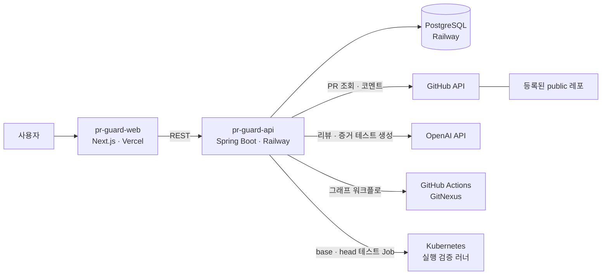

# 🛡️ PR Guard

**AI 네이티브 개발 환경에서, 속도는 그대로 두고 코드 품질을 지키는 PR 검증 계층**

동국대학교 창의융합경진대회 2026

> AI 가 코드를 쓰는 속도로 리뷰하고, 사람은 **증명된 위험**만 본다.

---

## 왜 만드나

AI 코딩 에이전트를 쓰면 PR 은 많아지고 커지는데, 사람이 리뷰할 수 있는 시간은 그대로입니다. 리뷰가 병목이 되고, 결국 "대충 보고 머지" 가 늘어납니다.

AI 가 쓴 코드는 그럴듯해 보이지만 이런 문제가 자주 섞여 들어옵니다.

- 요청하지 않은 변경, 빠진 구현
- 기존 동작을 **조용히** 바꾸는 수정 (예: 예외를 던지던 곳이 `null` 을 반환)
- 레포 맥락을 모른 채 고쳐서 깨지는 호출부, 늘 함께 바뀌던 파일의 누락
- 기존 테스트가 **한 번도 지나가지 않는** 곳의 변경

"AI 로 리뷰한다" 는 이제 흔합니다. PR Guard 는 **AI 의 말을 그대로 믿지 않고, 정적 분석 · 이력 통계 · 실제 실행으로 근거를 만든 뒤** 판정합니다. LLM 은 그 근거를 해석하는 역할만 맡습니다.

## AI 환경의 문제 → PR Guard 가 하는 일

| AI 환경에서 생기는 문제 | PR Guard | 근거를 만드는 방법 |
|---|---|---|
| 변경이 어디까지 번지는지 사람이 다 못 봄 | **영향 범위 시각화** | 함수 단위 호출 그래프에서 바뀐 함수 → 직접 · 간접 호출부 |
| AI 가 기존 동작을 몰래 바꿈 | **실행으로 증명** | 증거 테스트: base 에서 통과하고 head 에서 실패하는 테스트를 만들어 실제로 돌림 |
| 기존 테스트가 깨지는지 모름 | **실행 검증** | 쿠버네티스 Pod 에서 base · head 테스트를 돌려 회귀 비교 |
| 테스트가 실제로 그 코드를 지키는지 모름 | **런타임 트레이스** | 테스트 중 실제 호출을 기록해 바뀐 메서드를 지나간 테스트를 찾음 |
| 레포 맥락 · 관행을 모르는 코드 | **이력 기반 경고** | git 동시 변경 통계, 핫스팟, 숨은 결합 |
| 리뷰어 시간 부족 | **판정 + 근거 요약** | 규칙으로 계산한 판정, PR 코멘트, 단계별 파이프라인 화면 |

## 동작 방식

```
public 레포 URL 등록 → 온보딩 (GitNexus 코드 그래프 · 레포 브리핑)
        ↓
PR 자동 감지
        ↓
base / head 소스 인덱스 → 바뀐 메서드 · 호출부 · git 이력
        ↓
 ┌ 정적 검사  A. 의도 대비   B. 변경 영향   C. 보안 일관성   D. 변경 위험도
 ├ LLM 리뷰   (위 근거를 함께 전달)
 └ 실행 검증  쿠버네티스 Pod 에서 base · head 빌드 · 테스트
              + 증거 테스트 (동작 변화 증명) + 런타임 호출 기록
        ↓
판정 (머지 가능 / 수정 후 머지 / 머지 비권장) → PR 코멘트
```

- **이번 PR 이 새로 만든 문제만** 보고합니다 (base 에도 있던 문제는 뺌).
- 판정은 LLM 이 아니라 규칙이 계산합니다 (BLOCKER ≥ 1 → 머지 비권장, MAJOR ≥ 1 → 수정 후 머지).

## 화면

| 화면 | 보여 주는 것 |
|---|---|
| **리뷰 파이프라인** | 분석 단계가 실시간으로 켜지는 그래프, 실행 검증 레인(Pod 기동 · 빌드 · 테스트 · 차등 비교), 증거 테스트 판정 |
| **PR 영향 그래프 · 3D 영향 시티** | 바뀐 함수에서 호출을 거슬러 영향이 퍼지는 모습 |
| **코드 그래프** | 함수 = 점, 파일 = 상자. 런타임 오버레이로 실제로 불린 함수와 정적 분석이 놓친 호출 |
| **코드 인사이트** | 3D 코드 시티(시간 여행), 핫스팟, 숨은 결합, 런타임 열지도 |

## 인프라 구조



| 구성 | 위치 | 역할 |
|---|---|---|
| 프론트엔드 | Vercel | 레포 등록, 리뷰 · 그래프 · 인사이트 화면. 백엔드는 서버에서만 호출 |
| 백엔드 | Railway | PR 폴링, 분석 파이프라인, 판정, PR 코멘트 |
| DB | Railway PostgreSQL | 프로젝트 · PR · 리뷰 · 실행 기록. 백엔드만 내부망으로 접속 |
| 코드 그래프 | GitHub Actions | GitNexus 로 레포 인덱싱 (메모리가 커서 서버 밖에서 실행) |
| 실행 검증 | Kubernetes | PR 마다 base · head Job. 권한 없는 러너, 일회용 토큰으로만 결과 보고 |
| 외부 API | GitHub, OpenAI | PR · diff 조회와 코멘트 / LLM 리뷰 · 증거 테스트 생성 |

> 실행 검증은 쿠버네티스 연결을 켠 환경에서 동작합니다. 현재 공개 서비스에서는 꺼져 있고, minikube 환경에서 검증했습니다.

## 레포지토리

| 레포 | 설명 |
|---|---|
| [pr-guard-api](https://github.com/dongguk-creative-fusion-2026/pr-guard-api) | 백엔드 — PR 폴링, 분석 파이프라인, 실행 검증, 리뷰 코멘트 (Spring Boot) |
| [pr-guard-web](https://github.com/dongguk-creative-fusion-2026/pr-guard-web) | 프론트엔드 — 리뷰 파이프라인, 코드 그래프, 코드 인사이트 (Next.js) |
| [pr-guard-sandbox](https://github.com/dongguk-creative-fusion-2026/pr-guard-sandbox) | 테스트 · 평가용 레포 (평가 PR #1~#9) |
| [demo-petclinic](https://github.com/dongguk-creative-fusion-2026/demo-petclinic) | 커밋 이력이 긴 시연용 레포 |

## 바로 보기

- 서비스: https://pr-guard-web.vercel.app
- 리뷰 예시: [pr-guard-sandbox PR #1](https://github.com/dongguk-creative-fusion-2026/pr-guard-sandbox/pull/1)
